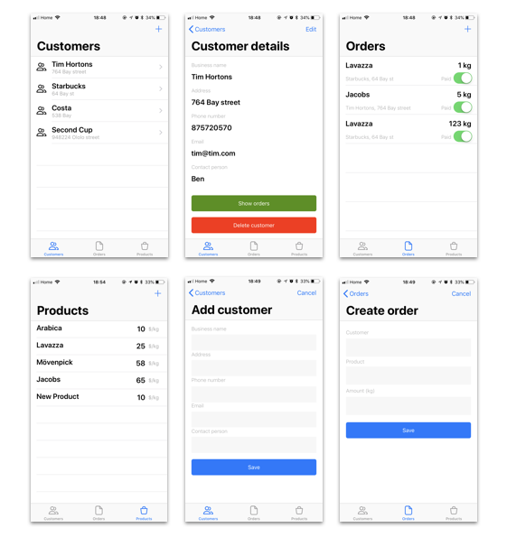

# iOS Sales Tracking App

MAPD 2017-18, Enterprise Tech, term project. iOS App to track customers, orders and products in a B2B sales scenario (in our case it is a coffee sales company). The app uses this [REST API](https://github.com/deepstereo/mapd-project1-rest-api) with Mongo DB storage as back end.

The app uses Codable protocol intoduced in iOS 11 / Swift 4 to work with JSON data.

## App screenshots

